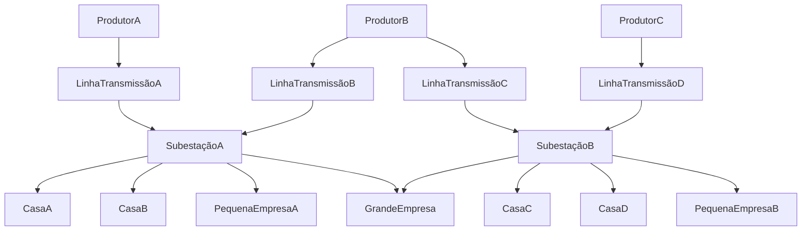

# Blockchain Project - Gestão Inteligente do Smart Grid

## Sobre o Projeto

O projeto faz uma proposta de um sistema que busca melhorar o controle sobre uma [Rede elétrica inteligente](https://pt.wikipedia.org/wiki/Rede_el%C3%A9trica_inteligente), com vários [smart-meters](https://en.wikipedia.org/wiki/Smart_meter) instalados por ela.

Para isso, esse projeto implementa

- Simulador da rede elétrica.
- Contratos para gerir a rede.
- Gerador de relatório das transações.
- _UI para gestão e monitoramento da rede (TODO)_

## Sobre a Simulação



## Tecnologias Utilizadas

- Simulador da rede elétrica & Gerador de relatório das transações
  - [Python](https://www.python.org/): Linguagem de Programação
  - [web3 (python library)](https://web3py.readthedocs.io/en/stable/): Biblioteca para interação com Ethereum
- Contratos para gerir a rede
  - [Solidity](https://soliditylang.org/): Linguagem de programação usada para os contratos
  - [TypeScript](https://www.typescriptlang.org/): Linguagem de programação para desenvolvimento dos testes
  - [chai](https://www.chaijs.com/): Biblioteca de Testes
  - [hardhat](https://hardhat.org/): Ambiente de desenvolvimento Ethereum
  - [ethers](https://docs.ethers.org/v5/): Biblioteca para desenvolvimento de Ethereum

## Instalação das Dependências

### Pré Requisitos

Garanta que haja os seguintes programas estejam instalados

- [NodeJS](https://nodejs.org/en/download/package-manager)
- [Python](https://www.python.org/downloads/)

### Instalação das dependências do Simulador

```bash
cd grid
cd pip install -r requirements.txt
```

### Instalação das dependências para o ambiente de desenvolvimento dos contratos

```bash
cd blockchain
npm i
```

## Execução do Projeto

### Execução dos testes dos contratos

```bash
cd blockchain
npm run test
```

### Execução da Rede de Blockchain Local

```bash
cd blockchain
npm run node
```

### Deploy dos Contratos na Rede local

```bash
cd blockchain
npm run ignition:localhost
```

### Execução da Simulação da Rede Elétrica

```bash
cd grid
python3 main.py
```

## Oportunidades

- Implementar teste de integração
- Simulações mais realistas
- Desenvolver UI para monitorar e configurar a rede
- Melhorar contratos
  - Performance
  - Integridade

# Modelo do Negócio

### Key Partners

Fabricantes de smart-meters, pequenos e médios produtores de energia e empresas de equipamentos de produção de energia elétrica

### Key Activities

Instalação do software e dos smart-meters, suporte técnico aos parceiros

### Key Resources

Time de desenvolvimento, time de suporte, smart-meters

### Value Propositions

Possibilitar a gestão inteligente da energia para distribuidores de energia elétrica, focando em pequenas e médias empresas

### Customer Relationships

Assistência técnica, promoções em smart-meters e atualizações gratuitas

### Channels

Equipe de vendas mostrando as vantagens aos produtores, parcerias com empresas de painéis solares

### Customer Segments

Consumidores e geradores de energia elétrica, principalmente em pequena e média escala

### Cost Structure

Produção dos smart-meters e estrutura de trabalho para os desenvolvedores e suporte

### Revenue Streams

Assinaturas do software, venda dos smart-meters, planos de assistência técnica
